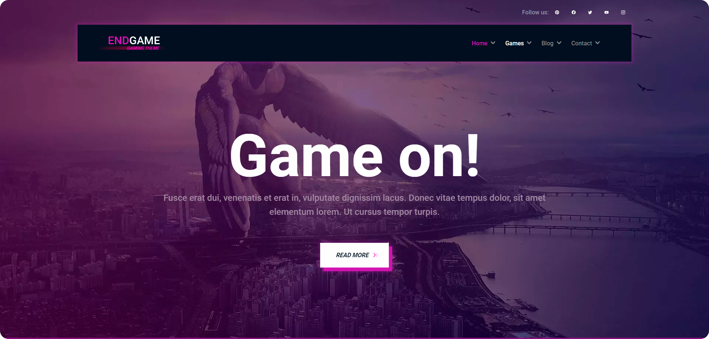

![GitHub repo size][reposize-shield]
[![Contributors][contributors-shield]][contributors-url]
[![Forks][forks-shield]][forks-url]
[![Stargazers][stars-shield]][stars-url]
[![Issues][issues-shield]][issues-url]

 

  

  <h3 align="center"></h3>

  

    An blog about games and reviews
     
     
    <a href="https://brennofruhauf.github.io/endgame">View Website</a>
    ·
    <a href="https://github.com/BrennoFruhauf/endgame/issues">Report Bug</a>
    ·
    <a href="https://github.com/BrennoFruhauf/endgame/issues">Request Feature</a>
  

<!-- 

  
Table of Contents

  <ol>
    <li>
      <a href="#about-the-project">About The Project</a>
      <ul>
        <li><a href="#built-with">Built With</a></li>
      </ul>
    </li>
    <li>
      <a href="#getting-started">Getting Started</a>
      <ul>
        <li><a href="#prerequisites">Prerequisites</a></li>
        <li><a href="#installation">Installation</a></li>
      </ul>
    </li>
    <li><a href="#usage">Usage</a></li>
    <li><a href="#roadmap">Roadmap</a></li>
    <li><a href="#contributing">Contributing</a></li>
    <li><a href="#license">License</a></li>
    <li><a href="#contact">Contact</a></li>
    <li><a href="#acknowledgments">Acknowledgments</a></li>
  </ol>

 -->

 

# About The Project

This is my first training project with Angular, it consists of a blog that has posts about games and reviews.

The layout was inspired by the [EndGame Gaming Theme](https://preview.colorlib.com/theme/endgam/index.html), minor changes and responsiveness improvements were made.

 

## Built With

 

  
  
  

<a href="#readme-top">⬆ Back to top</a>

# Roadmap

- [ ] Home page
  - [X] Add layout
  - [X] Add responsiveness
  - [ ] Add dynamic content
    - [ ] Intro cards section
    - [ ] Latest news section
    - [ ] Trending section
    - [ ] Big card section
  
 

- [ ] Games page
  - [X] Add layout
  - [X] Add responsiveness
  - [ ] Add dynamic content
    - [x] Card section
    - [ ] Letter filter
    - [ ] Platform filter
    - [ ] Genrer filter
  - [X] Card details page
    - [X] Add layout
    - [X] Add responsiveness
    - [X] Add dynamic content

 

- [ ] Blog page
  - [ ] Add layout
  - [ ] Add responsiveness
  - [ ] Add dynamic content

 

- [ ] Contact page
  - [ ] Add layout
  - [ ] Add responsiveness

<a href="#readme-top">⬆ Back to top</a>

<!-- MARKDOWN LINKS & IMAGES -->
[reposize-shield]: https://img.shields.io/github/repo-size/BrennoFruhauf/endgame?style=for-the-badge
[contributors-shield]: https://img.shields.io/github/contributors/BrennoFruhauf/endgame?style=for-the-badge
[contributors-url]: https://github.com/BrennoFruhauf/endgame/graphs/contributors
[forks-shield]: https://img.shields.io/github/forks/BrennoFruhauf/endgame?style=for-the-badge
[forks-url]: https://github.com/BrennoFruhauf/endgame/network/members
[stars-shield]: https://img.shields.io/github/stars/BrennoFruhauf/endgame?style=for-the-badge
[stars-url]: https://github.com/BrennoFruhauf/endgame/stargazers
[issues-shield]: https://img.shields.io/github/issues/BrennoFruhauf/endgame?style=for-the-badge
[issues-url]: https://github.com/BrennoFruhauf/endgame/issues
